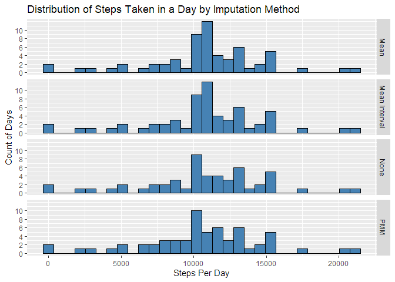
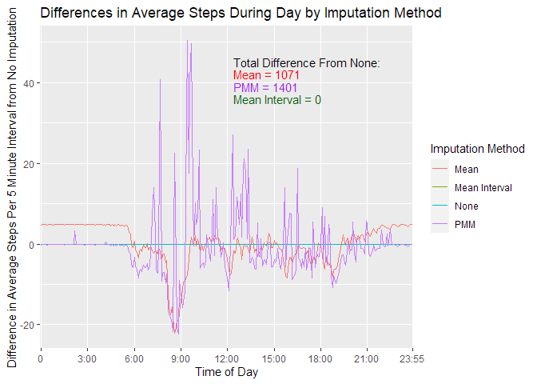

Darrell Gerber  
March 3, 2021  

## Loading and preprocessing the data
Load the data from the zip file included in the project. Convert the data to a data.table for further processing.

```r
library(data.table)
unzip("activity.zip", overwrite = TRUE)
rawData <- read.csv("activity.csv")
Data <- data.table(rawData)
noNAData <- Data[!is.na(Data$steps),]
```


## What is mean total number of steps taken per day?
Aggregate the data first by summing the steps for each day. Then calculate the mean and median of the daily steps. Plot the distribution of steps per day along with the mean and median values. 

```r
library(data.table)
DaySteps <- noNAData[,list(sum_steps = sum(steps, na.rm = T)),by='date']
avgDaySteps <- mean(DaySteps$sum_steps)
medianDaySteps <- median(DaySteps$sum_steps)
```


<!-- -->
  
## What is the average daily activity pattern?
Find the average number of steps for each interval across all the days of the study. Readings are taken at 5 minutes intervals throughout the day for the months of October and November, 2012. Calculate the interval with highest average value and the average number of steps at that time. Plot the average steps throughout the day and annotate the maximum values. 

```r
avgIntervalSteps <- noNAData[,list(mean_steps = mean(steps, na.rm = T)), by='interval']
MaxInterval <- which.max(avgIntervalSteps$mean_steps)
MaxIntervalTime <- avgIntervalSteps[MaxInterval,]$interval
MaxIntervalSteps <- avgIntervalSteps[MaxInterval,]$mean_steps
```
<!-- -->
  
## Imputing missing values
NOTE: This section is more sophisticated than required in the assignment. If you are not interested in seeing an evaluation of three imputation methods, skip to the end.  

First, do a quick check to determine where the missing values occur

```r
library(knitr)
sumNA <- lapply(Data, function(x) sum(is.na(x)))
print(kable(as.data.frame(sumNA), type="html"))
```


| steps| date| interval|
|-----:|----:|--------:|
|  2304|    0|        0|
All of the missing data is in the steps variable and none are found in the 'interval' or 'date' variables.  
  
Next, check to see what the distribution of missing values are by 'date'.

```r
dateNA <- Data[,list(isnaCount = sum(is.na(steps), na.rm = T)), by='date']
```
<!-- -->
  
From this graph, we can see that all of the missing data occurs on 8 dates. On each date, there are 288 missing values. Since the readings are taken every 5 minutes, there are 288 readings per day. In other words, whenever there is missing data, it is missing for the entire day.
  
That influences the choice of the imputation method because it is not an option to use same day readings to construct a replacement value.
  
We will use three different methods to see how the results compare.       
1. Using the MICE package, impute the missing data using the 'mean' method. The Mean method replaces the missing step data with the average of all interval step counts across the dataset. 

```r
library(mice)
imp <- mice(Data, method = "mean", m=1)
impData <- data.table(complete(imp))
impDaySteps <- impData[,list(sum_steps = sum(steps, na.rm = T)),'date']
impavgDaySteps <- mean(impDaySteps$sum_steps)
impmedianDaySteps <- median(impDaySteps$sum_steps)
impsdDaySteps <- sd(impDaySteps$sum_steps)
```
  
2. Using the MICE package, impute the missing data using the 'pmm' method. For each missing entry, the PMM method (predictive mean matching)  forms a small set of candidate donors from all complete cases that have predicted values closest to the predicted value for the missing entry. One donor is randomly drawn from the candidates, and the observed value of the donor is taken to replace the missing value. 

```r
imp <- mice(Data, method = "pmm", m=1)
pmmData <- data.table(complete(imp))
pmmDaySteps <- pmmData[,list(sum_steps = sum(steps, na.rm = T)),'date']
pmmavgDaySteps <- mean(pmmDaySteps$sum_steps)
pmmmedianDaySteps <- median(pmmDaySteps$sum_steps)
pmmsdDaySteps <- sd(pmmDaySteps$sum_steps)
```
3. The third method will rely on the characteristic of the missing data noted above where the either the whole day is missing or all of the data is available. The third method (called Mean Intervals below) replaces the missing days with an average day (the mean by interval across all non-missing days).

```r
mimpData <- Data
mimpData$steps[is.na(mimpData$steps)] <- avgIntervalSteps[interval%in%mimpData$interval]$mean_steps
mimpDaySteps <- mimpData[,list(sum_steps = sum(steps, na.rm = F)),'date']
mimpavgDaySteps <- mean(mimpDaySteps$sum_steps)
mimpmedianDaySteps <- median(mimpDaySteps$sum_steps)
mimpsdDaySteps <- sd(mimpDaySteps$sum_steps)
```

Histograms of the four data sets (no imputation, Mean imputation, PMM imputation, and Mean Interval imputation) reveal that all imputations replaced missing values with realistic substitutes calculated from the data set. The Mean and Mean Interval methods give the same results, as should be expected.The all also reduce the standard deviation of the values and either reduce or eliminate the difference between the mean and median. 

<!-- -->
  

|        |     None|      Mean|       PMM| Mean Interval|
|:-------|--------:|---------:|---------:|-------------:|
|Mean    | 10766.19| 10766.189| 10186.410|     10766.189|
|Median  | 10765.00| 10766.189| 10395.000|     10766.189|
|Std Dev |  4269.18|  3974.391|  4274.366|      3974.391|
Another important consideration is the effect the imputation method may have on the activity patterns during the day. The graph below is similar to the analysis of the average daily activity performed above. However, we look at the **difference between each imputation method and the average daily activity with no imputation**. The sum of the absolute value of the difference is calculated and annotated in the graph.  

The Mean method causes a significant shift during the times of day when the activity is small or zero and during the peak times of the day. The PMM method performs better during low activity periods but has widely fluctuating deviations during the remainder of the day. The Mean Interval method matches exactly the non-imputed average over the day since that was the basis for this imputation approach.
  
<!-- -->
  
The Mean Interval imputation method is the preferred method for this data set. It matches the performance of the generalize methods when looking at shifts in the mean, median, and standard deviation of the data and significantly outperforms them in modifications to the average daily activity patterns.  


## Are there differences in activity patterns between weekdays and weekends?
Add a factor variable to the Mean Interval data set to indicate if it is a weekend or weekday. Calculate the average steps during the days dependent on the new factor variable and plot.

```r
mimpData$weekday <- ifelse(weekdays(as.Date(mimpData$date)) %in% c('Sunday', 'Saturday'),
                                'Weekend', 'Weekday')
mimpavgWDIntervalSteps <- mimpData[,list(mean_steps = mean(steps, na.rm = T)),
                                   by=c('interval', 'weekday')]
```
  
The basic activity patterns during the weekend do not deviate significantly from those during the week, but there are some interesting results:  

* The early morning activity is significantly reduced on the weekend.
* The peak activity occurs at about the same time  of the day but the maximum is a little more than half the weekday peak. This may be due to a shorter morning run on weekends.
* The midday activity levels are higher on the weekend. 
* The evening activity levels extend later into the night on weekends.
<!-- -->
